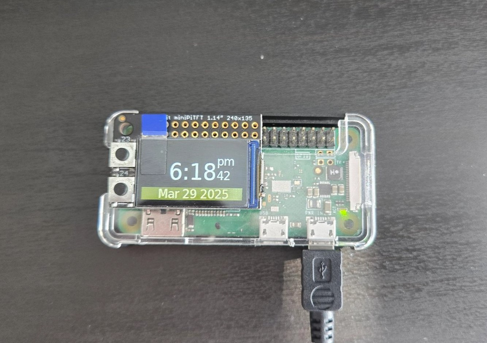
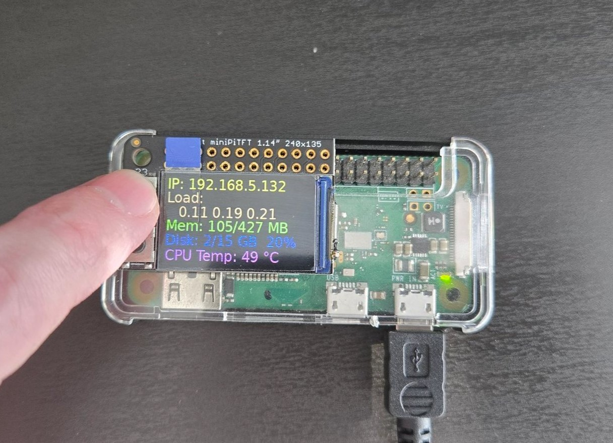
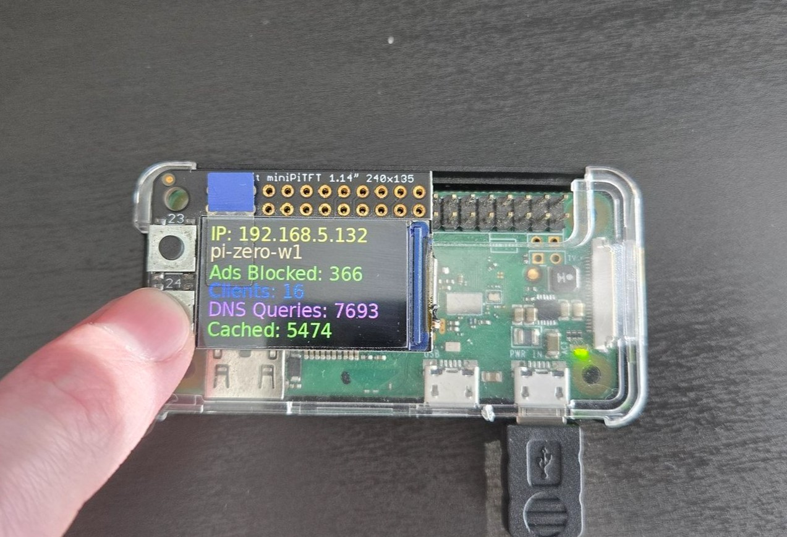

# ZeroDash

## Description
This is a simple project that shows basic stats on Adafruit Mini PiTFT display (on ST7789 controller). 
Currently designed specifically for [Adafruit Mini PiTFT - 135x240 Color TFT Add-on for Raspberry Pi](https://www.adafruit.com/product/4393)
and Raspbery Pi Zero running PiHole DNS Ads Blocker to show you basic stats.

It uses: 
- WiringPi to communicate with display/buttons
- GD library to draw and write text
- Curl to call PiHole API
- nlohmann/json to parse API json response

## Example
### Main screen. Displays Date and Time

### Pressed Button A. Displays system stats for 10 seconds, then resets back to main screen


System stats:
- IP Address
- Load for 1/5/15 mins
- Memory used/total
- Disk space used/total
- CPU Temperature

### Pressed Button B. Displays PiHole stats for 10 seconds, then resets back to main screen


PiHole Stats
- IP Address
- Hostname
- Total Ads blocked
- Total Clients
- Total DNS Queries
- Number of cached domains

## Installation

### Prerequisites

#### WiringPi installation
```sh
mkdir ~/wiringPi && cd ~/wiringPi

# 32 bit release Bookworm, Pi Zero 1, all 32 bit systems
wget https://github.com/WiringPi/WiringPi/releases/download/3.14/wiringpi_3.14_armhf.deb
sudo apt install ./wiringpi_3.14_armhf.deb

# 64 bit release Bookworm, PI Zero 2 and all other 64 bit systems
#wget https://github.com/WiringPi/WiringPi/releases/download/3.14/wiringpi_3.14_arm64.deb
#sudo apt install ./wiringpi_3.14_arm64.deb
```

Enable SPI
```sh
sudo raspi-config
```
Go to Interface Options, select SPI and enable it

#### Installation of all dependencies
```sh
sudo apt update
sudo apt install --no-install-recommends -y \
 libgd-dev curl libcurl4-openssl-dev nlohmann-json3-dev cmake
```

### Compilation

```sh
mkdir -p ~/ZeroDash/src && cd ~/ZeroDash/src
```
copy/clone all code in this folder

Then compile:
```sh
mkdir build && cd build
cmake ..
cmake --build .
cp build/{ZeroDash,default.conf} ../../ && cd ../../
```

### Configuration

Now it needs to get API Password. It can be done by going to PiHole Web UI -> Web Interface API Settings.
Switch to Basic->Expert, then in Advance Setting block click on "Configure app password". Generate and enable new app password.

Now open default.conf, configure `apiServerUri` and `apiServerPassword` parameters.
Should be something like that:
```sh
> cat default.conf
#
# PiHole server
# example: http://localhost, http://192.168.0.3
apiServerUri=http://localhost
#
# PiHole password, app password, token
apiServerPassword=<APP_PASSWORD_HERE>
```

### Make it run on boot

Open/create `rc.local`
```sh
> sudo nano /etc/rc.local
```
and add command to run on boot. Should be like that:
```sh
> cat /etc/rc.local
#!/bin/sh -e

su user -c 'sleep 60 && cd ~/ZeroDash && ./ZeroDash' &

exit 0
```
Replace `user` and adjust `sleep time` if clocks doesn't run after reboot, give more time to run all services before starting ZeroDash

### Bonus. Configuration steps to setup pi from scratch

```sh
##### system update #####
sudo apt update && sudo apt upgrade -y && sudo apt autoremove -y

##### PiHole intallation #####

# https://github.com/pi-hole/pi-hole/#one-step-automated-install
curl -sSL https://install.pi-hole.net | bash

##### installing WiringPi #####

mkdir ~/wiringPi && cd ~/wiringPi
# 32 bit release Bookworm, Pi Zero 1, all 32 bit systems
wget https://github.com/WiringPi/WiringPi/releases/download/3.14/wiringpi_3.14_armhf.deb
sudo apt install ./wiringpi_3.14_armhf.deb

# 64 bit release Bookworm, PI Zero 2 and all other 64 bit systems
#wget https://github.com/WiringPi/WiringPi/releases/download/3.14/wiringpi_3.14_arm64.deb
#sudo apt install ./wiringpi_3.14_arm64.deb

sudo raspi-config
# go to Interface Options, select SPI and enable it

##### dependencies #####

sudo apt install --no-install-recommends -y \
 libgd-dev curl libcurl4-openssl-dev nlohmann-json3-dev cmake

##### compilation #####

# compile
mkdir -p ~/ZeroDash/src && cd ~/ZeroDash/src
# copy code here
mkdir build && cd build
cmake ..
cmake --build .
cp build/{ZeroDash,default.conf} ../../ && cd ../../

##### configuration #####

# go to PiHole Web UI -> Web Interface API Settings. 
# Switch to Bacic->Expert, in Advance Setting block click on "Configure app password". 
# Generate and enable new app password.
# open default.conf, configure apiServerUri and apiServerPassword parameters

##### run on boot #####

sudo nano /etc/rc.local
8<----cut-----
#!/bin/sh -e

su user -c 'sleep 60 && cd ~/ZeroDash && ./ZeroDash' &

exit 0
8<----cut-----
```

# Acknowledgments

- Inspired by [Adafruit CircuitPython RGBDisplay](https://github.com/adafruit/Adafruit_CircuitPython_RGB_Display) python library
- Very helpful [display configuration info](https://github.com/russhughes/st7789_mpy?tab=readme-ov-file#optional-keyword-arguments)
